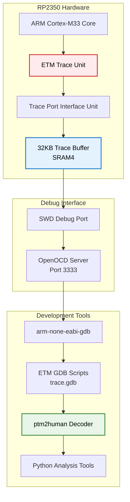
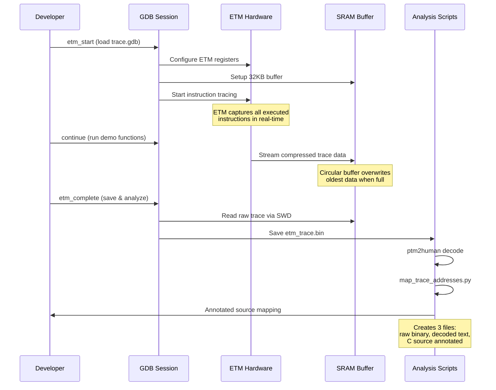
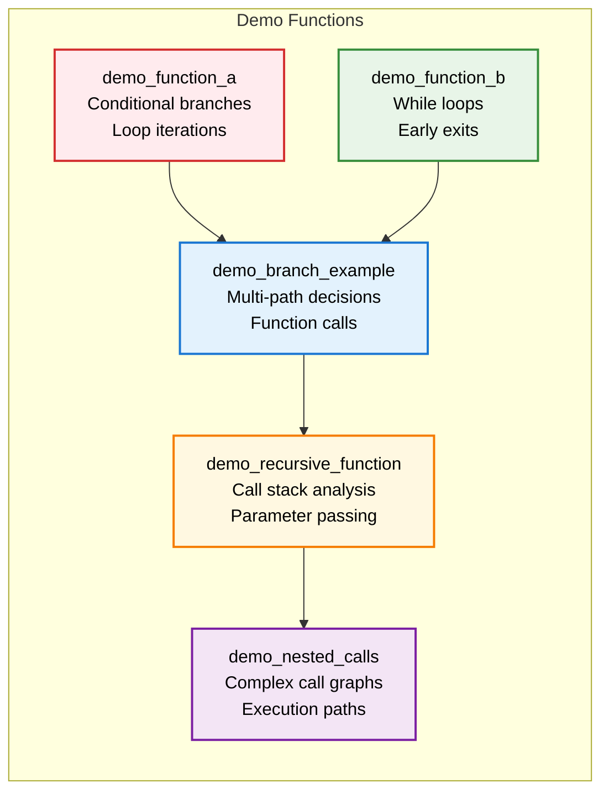

# RP2350 Pico 2 ETM Tracing Educational Platform

[](https://opensource.org/licenses/MIT)
[](https://www.raspberrypi.com/products/raspberry-pi-pico-2/)
[](https://developer.arm.com/Processors/Cortex-M33)

> **A complete bare-metal ETM (Embedded Trace Macrocell) tracing system for ARM Cortex-M33 education and debugging on the Raspberry Pi Pico 2.**

## 🎯 Project Overview

This project demonstrates advanced ARM Cortex-M33 instruction tracing using the **Embedded Trace Macrocell (ETM)** on the RP2350 microcontroller. It provides a complete educational platform for understanding real-time program execution flow, branch prediction analysis, and low-level debugging techniques.

### Key Achievements
- ✅ **Complete ETM hardware initialization** for RP2350 Cortex-M33
- ✅ **Automated GDB workflow** with enhanced trace commands
- ✅ **Source-level trace analysis** with C function mapping
- ✅ **Educational demo functions** for instruction flow visualization
- ✅ **Cross-platform analysis pipeline** (Windows/Linux compatible)

https://github.com/user-attachments/assets/1cb3f008-8264-42b0-9f41-8c398d6bb62c

## 🏗️ System Architecture



## 🔬 ETM Trace Flow



## 🛠️ Technical Implementation

### ETM Configuration
- **Buffer Size**: 32KB (32768 bytes).
- **DMA Channel**: 12 for high-speed trace capture

### Power Domain Management
```c
// Correct RP2350 base addresses
#define PSM_BASE        0x40018000  // Power State Machine
#define CLOCKS_BASE     0x40010000  // Clock Control
#define RESETS_BASE     0x40020000  // Reset Control

// ETM-specific power domains
PSM_FRCE_ON |= (1 << 0) | (1 << 1) | (1 << 2) | (1 << 3);
```

### CoreSight Authentication
```c
// ETM unlock sequence
*etm_unlock = 0xC5ACCE55;  // CoreSight unlock key
*dbgauthstatus = 0x0000000F;  // Enable debug authentication
```

## 📊 Educational Demo Functions



## 🚀 Quick Start Guide

### Prerequisites
- **Hardware**: Raspberry Pi Pico 2 (RP2350)
- **Debugger**: Any SWD-compatible debug probe (Picoprobe, etc.)
- **Environment**: MSYS2 MinGW64 terminal
- **Toolchain**: ARM GCC toolchain (`arm-none-eabi-gcc`)
- **IDE**: VS Code with C/C++ extension, cortex-debug
- **Debug Server**: OpenOCD with RP2350 support

### Build the Firmware
```bash
# Navigate to build directory
cd Blinky_Pico2_dual_core_nosdk/Build

# Build using make
make CORE_FAMILY=ARM
```

### Start OpenOCD Debug Server
```bash
# In MSYS2 MinGW64 terminal, navigate to OpenOCD directory
cd ~/PICO/openocd

# Start OpenOCD with RP2350 configuration
src/openocd.exe -f interface/cmsis-dap.cfg -c "adapter speed 5000" -f target/rp2350-rescue.cfg -s tcl
```

### VS Code Debug Session
1. **Open** `main.c` in VS Code
2. **Place cursor** anywhere in the file
3. **Press F5** to start GDB debug session
4. **Set breakpoints** before and after the code sections you want to trace


*Strategic breakpoint placement for ETM trace capture*

### ETM Tracing Workflow
```gdb
# When stopped at first breakpoint, load ETM scripts
source C:/Users/tabre/Desktop/Pico 2/Blinky_Pico2_dual_core_nosdk/etm_enhanced_trace.gdb

# Start ETM tracing
etm_start

# When stopped at second breakpoint, save and analyze
etm_complete
```

### Analysis Results
After running `etm_complete`, check the `trace/` directory for:
- `etm_trace.bin` - Raw ETM data
- `etm_ptm2human.txt` - Decoded instruction trace  
- `etm_ptm2human_annotated.txt` - Source-mapped trace with C function names

### Troubleshooting
- **OpenOCD connection issues**: Ensure debug probe is connected and recognized
- **Build errors**: Verify ARM toolchain is in PATH
- **ETM trace empty**: Check breakpoint placement around demo functions
- **Permission errors**: Run MSYS2 terminal as administrator if needed

## 📈 Analysis Results

### Educational Value
- **Branch Analysis**: Conditional and unconditional branch patterns
- **Function Calls**: Call/return sequences with parameter passing
- **Loop Behavior**: Iteration patterns and early exits
- **Memory Access**: Load/store instruction analysis
- **Register Usage**: Multi-register operation patterns (r0-r15)

## 🔧 Advanced Features

### GDB Automation Commands
```gdb
# Load ETM scripts and start tracing
source etm_enhanced_trace.gdb
etm_start

# Complete workflow: save + decode + annotate
etm_complete
```

### PTM2Human Decoder
```bash
# Decode raw ETM data to human-readable trace
ptm2human.exe -t etm_trace.bin > etm_ptm2human.txt
```

**Decoder Features:**
- ARM ETM compression protocol support
- Branch tracking and function call identification
- Address-to-source mapping integration

### Automated Analysis Pipeline
```bash
# Complete analysis workflow
etm_analyze.bat
```

**Output Files:**
- `trace/etm_trace.bin` - Raw ETM data
- `trace/etm_ptm2human.txt` - Decoded instruction trace
- `trace/etm_ptm2human_annotated.txt` - Source-mapped trace

### Cross-Platform Support
- **Windows**: PowerShell scripts with batch automation
- **Linux**: Bash scripts with equivalent functionality
- **Tools**: Compiled ptm2human decoder included

## 📚 Educational Applications

### For Students
- Understanding ARM Cortex-M33 instruction execution
- Real-time program flow visualization
- Branch prediction and pipeline analysis
- Debugging complex embedded systems

### For Educators
- Hands-on ARM architecture teaching
- Advanced debugging technique demonstration
- Real-world embedded systems analysis
- Research platform for trace analysis algorithms

## 🏆 Technical Achievements

### Hardware Integration
- **Solved**: RP2350 ETM peripheral access with complete power domain management
- **Implemented**: CoreSight authentication sequence with proper unlock keys
- **Configured**: 32KB SRAM4 trace buffer with power-of-2 alignment for DMA ring buffer operation
- **Optimized**: Clock and reset control for all trace subsystems (PSM, RESETS, CLOCKS)

### Software Innovation
- **Created**: Complete automated analysis pipeline (`etm_analyze.bat` + `map_trace_addresses.py`)
- **Built**: Educational demo functions with rich branching patterns for instruction tracing
- **Developed**: Enhanced GDB command suite (`etm_enhanced_trace.gdb`) with simplified workflow
- **Integrated**: PTM2Human decoder with source-level annotation capabilities

  ### Educational Platform
- **Designed**: Six specialized demo functions (`demo_function_a/b`, `demo_branch_example`, `demo_loop_example`, `demo_recursive_function`, `demo_nested_calls`)
- **Implemented**: Real-time LED feedback synchronized with trace capture
- **Established**: Complete toolchain integration (ARM GCC + OpenOCD + GDB + Python analysis)

## 📁 Project Structure

```
├── Blinky_Pico2_dual_core_nosdk/     # Main firmware project
│   ├── Code/Appli/                   # Application code
│   │   ├── main.c                    # Main application
│   │   ├── etm_demo.c               # Educational demo functions
│   │   └── etm_demo.h               # Demo function headers
│   ├── Build/                        # Build system
│   ├── Tools/                        # Development tools
│   │   └── ptm2human/               # Trace decoder
│   ├── etm-scripts/                  # ETM GDB scripts
│   ├── etm_enhanced_trace.gdb       # Enhanced GDB commands
│   ├── etm_analyze.bat              # Windows analysis script
│   └── map_trace_addresses.py       # Address mapping tool
└── trace/                           # Trace output directory
```

## 🤝 Contributing

This project serves as an educational platform. Contributions welcome for:
- Additional demo functions
- Enhanced analysis algorithms
- Cross-platform improvements
- Documentation enhancements

## 📄 License

MIT License - See LICENSE file for details.

## 🙏 Acknowledgments

- **czietz/etm-trace-rp2350** - ETM GDB scripts foundation
- **czietz/ptm2human** - ARM trace decoder
- **Raspberry Pi Foundation** - RP2350 platform
- **ARM Limited** - Cortex-M33 and ETM documentation

---

> **Ready for Educational Deployment** - This project provides a complete, working ETM tracing system optimized for educational use with meaningful trace patterns and comprehensive analysis tools.
