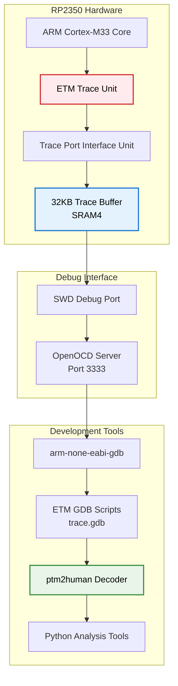
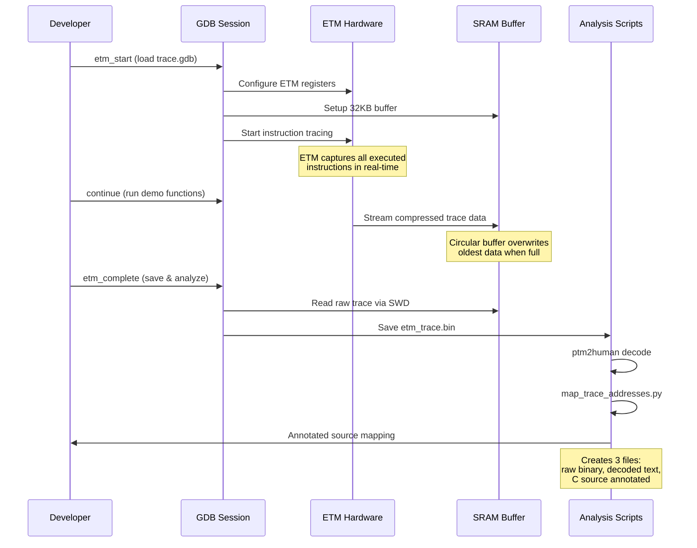
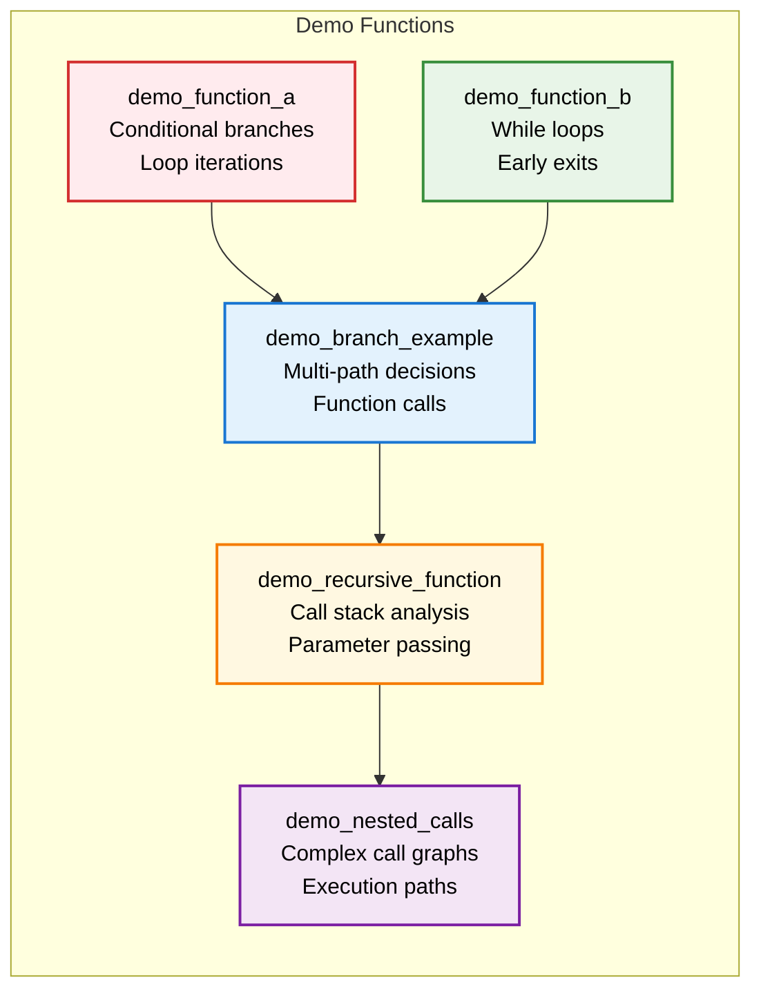

# RP2350 Pico 2 ETM Tracing Educational Platform

[](https://opensource.org/licenses/MIT)
[](https://www.raspberrypi.com/products/raspberry-pi-pico-2/)
[](https://developer.arm.com/Processors/Cortex-M33)

> **A complete bare-metal ETM (Embedded Trace Macrocell) tracing system for ARM Cortex-M33 education and debugging on the Raspberry Pi Pico 2.**

## 🎯 Project Overview

This project demonstrates advanced ARM Cortex-M33 instruction tracing using the **Embedded Trace Macrocell (ETM)** on the RP2350 microcontroller. It provides a complete educational platform for understanding real-time program execution flow, branch prediction analysis, and low-level debugging techniques.

### Key Achievements
- ✅ **Complete ETM hardware initialization** for RP2350 Cortex-M33
- ✅ **Automated GDB workflow** with enhanced trace commands
- ✅ **Source-level trace analysis** with C function mapping
- ✅ **Educational demo functions** for instruction flow visualization
- ✅ **Cross-platform analysis pipeline** (Windows/Linux compatible)

https://github.com/user-attachments/assets/1cb3f008-8264-42b0-9f41-8c398d6bb62c

## 🏗️ System Architecture



## 🔬 ETM Trace Flow



## 🛠️ Technical Implementation

### ETM Configuration
- **Buffer Size**: 32KB (32768 bytes).
- **DMA Channel**: 12 for high-speed trace capture

### Power Domain Management
```c
// Correct RP2350 base addresses
#define PSM_BASE        0x40018000  // Power State Machine
#define CLOCKS_BASE     0x40010000  // Clock Control
#define RESETS_BASE     0x40020000  // Reset Control

// ETM-specific power domains
PSM_FRCE_ON |= (1 << 0) | (1 << 1) | (1 << 2) | (1 << 3);
```

### CoreSight Authentication
```c
// ETM unlock sequence
*etm_unlock = 0xC5ACCE55;  // CoreSight unlock key
*dbgauthstatus = 0x0000000F;  // Enable debug authentication
```

## 📊 Educational Demo Functions



## 🚀 Quick Start Guide

### Prerequisites
- **Hardware**: Raspberry Pi Pico 2 (RP2350)
- **Debugger**: Any SWD-compatible debug probe (Picoprobe, etc.)
- **Environment**: MSYS2 MinGW64 terminal
- **Toolchain**: ARM GCC toolchain (`arm-none-eabi-gcc`)
- **IDE**: VS Code with C/C++ extension, cortex-debug
- **Debug Server**: OpenOCD with RP2350 support

### Build the Firmware
```bash
# Navigate to build directory
cd Blinky_Pico2_dual_core_nosdk/Build

# Build using make
make CORE_FAMILY=ARM
```

### Start OpenOCD Debug Server
```bash
# In MSYS2 MinGW64 terminal, navigate to OpenOCD directory
cd ~/PICO/openocd

# Start OpenOCD with RP2350 configuration
src/openocd.exe -f interface/cmsis-dap.cfg -c "adapter speed 5000" -f target/rp2350-rescue.cfg -s tcl
```

### VS Code Debug Session
1. **Open** `main.c` in VS Code
2. **Place cursor** anywhere in the file
3. **Press F5** to start GDB debug session
4. **Set breakpoints** before and after the code sections you want to trace


*Strategic breakpoint placement for ETM trace capture*

### ETM Tracing Workflow
```gdb
# When stopped at first breakpoint, load ETM scripts
source C:/Users/tabre/Desktop/Pico 2/Blinky_Pico2_dual_core_nosdk/etm_enhanced_trace.gdb

# Start ETM tracing
etm_start

# When stopped at second breakpoint, save and analyze
etm_complete
```

### Analysis Results
After running `etm_complete`, check the `trace/` directory for:
- `etm_trace.bin` - Raw ETM data
- `etm_ptm2human.txt` - Decoded instruction trace  
- `etm_ptm2human_annotated.txt` - Source-mapped trace with C function names

### Troubleshooting
- **OpenOCD connection issues**: Ensure debug probe is connected and recognized
- **Build errors**: Verify ARM toolchain is in PATH
- **ETM trace empty**: Check breakpoint placement around demo functions
- **Permission errors**: Run MSYS2 terminal as administrator if needed

## 📈 Analysis Results

### Educational Value
- **Branch Analysis**: Conditional and unconditional branch patterns
- **Function Calls**: Call/return sequences with parameter passing
- **Loop Behavior**: Iteration patterns and early exits
- **Memory Access**: Load/store instruction analysis
- **Register Usage**: Multi-register operation patterns (r0-r15)

## 🔧 Advanced Features

### GDB Automation Commands
```gdb
# Load ETM scripts and start tracing
source etm_enhanced_trace.gdb
etm_start

# Complete workflow: save + decode + annotate
etm_complete
```

### PTM2Human Decoder
```bash
# Decode raw ETM data to human-readable trace
ptm2human.exe -t etm_trace.bin > etm_ptm2human.txt
```

**Decoder Features:**
- ARM ETM compression protocol support
- Branch tracking and function call identification
- Address-to-source mapping integration

### Automated Analysis Pipeline
```bash
# Complete analysis workflow
etm_analyze.bat
```

**Output Files:**
- `trace/etm_trace.bin` - Raw ETM data
- `trace/etm_ptm2human.txt` - Decoded instruction trace
- `trace/etm_ptm2human_annotated.txt` - Source-mapped trace

### Cross-Platform Support
- **Windows**: PowerShell scripts with batch automation
- **Linux**: Bash scripts with equivalent functionality
- **Tools**: Compiled ptm2human decoder included

## 📚 Educational Applications

### For Students
- Understanding ARM Cortex-M33 instruction execution
- Real-time program flow visualization
- Branch prediction and pipeline analysis
- Debugging complex embedded systems

### For Educators
- Hands-on ARM architecture teaching
- Advanced debugging technique demonstration
- Real-world embedded systems analysis
- Research platform for trace analysis algorithms

## 🏆 Technical Achievements

### Hardware Integration
- **Solved**: RP2350 ETM peripheral access with complete power domain management
- **Implemented**: CoreSight authentication sequence with proper unlock keys
- **Configured**: 32KB SRAM4 trace buffer with power-of-2 alignment for DMA ring buffer operation
- **Optimized**: Clock and reset control for all trace subsystems (PSM, RESETS, CLOCKS)

### Software Innovation
- **Created**: Complete automated analysis pipeline (`etm_analyze.bat` + `map_trace_addresses.py`)
- **Built**: Educational demo functions with rich branching patterns for instruction tracing
- **Developed**: Enhanced GDB command suite (`etm_enhanced_trace.gdb`) with simplified workflow
- **Integrated**: PTM2Human decoder with source-level annotation capabilities

  ### Educational Platform
- **Designed**: Six specialized demo functions (`demo_function_a/b`, `demo_branch_example`, `demo_loop_example`, `demo_recursive_function`, `demo_nested_calls`)
- **Implemented**: Real-time LED feedback synchronized with trace capture
- **Established**: Complete toolchain integration (ARM GCC + OpenOCD + GDB + Python analysis)

## 📁 Project Structure

```
├── Blinky_Pico2_dual_core_nosdk/     # Main firmware project
│   ├── Code/Appli/                   # Application code
│   │   ├── main.c                    # Main application
│   │   ├── etm_demo.c               # Educational demo functions
│   │   └── etm_demo.h               # Demo function headers
│   ├── Build/                        # Build system
│   ├── Tools/                        # Development tools
│   │   └── ptm2human/               # Trace decoder
│   ├── etm-scripts/                  # ETM GDB scripts
│   ├── etm_enhanced_trace.gdb       # Enhanced GDB commands
│   ├── etm_analyze.bat              # Windows analysis script
│   └── map_trace_addresses.py       # Address mapping tool
└── trace/                           # Trace output directory
```

## 🤝 Contributing

This project serves as an educational platform. Contributions welcome for:
- Additional demo functions
- Enhanced analysis algorithms
- Cross-platform improvements
- Documentation enhancements

## 📄 License

MIT License - See LICENSE file for details.

## 🙏 Acknowledgments

- **czietz/etm-trace-rp2350** - ETM GDB scripts foundation
- **czietz/ptm2human** - ARM trace decoder
- **Raspberry Pi Foundation** - RP2350 platform
- **ARM Limited** - Cortex-M33 and ETM documentation

---


## ❓ Frequently Asked Questions (FAQ)

<details>
<summary><strong>🔧 Technical Architecture Questions</strong></summary>

### What is ETM and why use it over other debugging methods?

**ETM (Embedded Trace Macrocell)** is a hardware debugging unit built into ARM Cortex-M33 processors. Think of it as a "black box recorder" for your CPU that captures every instruction executed without slowing down your program.

- **ETM vs Printf**: Printf requires adding code to your program and uses CPU time. ETM is completely invisible to your running code.
- **ETM vs SWO (Serial Wire Output)**: SWO requires you to manually add trace points. ETM automatically captures everything.
- **ETM vs Simulation**: Shows real hardware behavior including timing, interrupts, and cache effects that simulators can't replicate perfectly.

### How does the trace data flow work?

```
CPU → ETM → TPIU → DMA → SRAM Buffer → SWD → OpenOCD → GDB → Analysis Tools
```

1. **CPU**: Executes your program normally
2. **ETM**: Hardware unit that "watches" every instruction and compresses the data
3. **TPIU (Trace Port Interface Unit)**: Formats the compressed data into packets
4. **DMA**: High-speed transfer to memory buffer without CPU involvement
5. **SRAM Buffer**: 32KB storage area at memory address 0x20040000
6. **SWD (Serial Wire Debug)**: Physical connection to your debug probe
7. **OpenOCD**: Software that talks to the debug probe
8. **GDB**: Debugger that reads the trace data
9. **Analysis Tools**: Python scripts and ptm2human decoder that make sense of the raw data

### How do you handle multi-core tracing?

The **funnel** at memory address `0x40147000` acts like a traffic controller - it selects which CPU core's ETM data gets sent to the trace system. 

- **CPUID register(CPU Identification register): Tells us which core we're running on (0 or 1)
- **Funnel configuration**: 
  - Bit 1 = Core 0 ETM input
  - Bit 3 = Core 1 ETM input
- **Current limitation**: We focus on Core 0 for educational simplicity, but the hardware supports both cores

*Think of it like having two security cameras (Core 0 and Core 1 ETM units) but only one recording device (TPIU) - the funnel decides which camera feeds into the recorder.*

### What happens when the 32KB buffer fills up?

We support two modes:

**Linear Mode** (default for education):
- Tracing stops when buffer is full
- Captures the first 32KB of execution
- Good for analyzing specific functions

**Circular Mode** (endless tracing):
- Buffer acts like a ring - new data overwrites oldest data
- Always captures the most recent 32KB of execution
- Requires buffer sizes of 8KB, 16KB, or 32KB with special memory alignment

### How accurate is the timing information?

**ETM tracing has ZERO impact on program timing** because:
- Hardware operates independently of CPU execution
- No software overhead or interrupts
- DMA transfers happen in parallel with CPU execution
- Only post-processing analysis takes time (which happens after your program runs)

</details>

<details>
<summary><strong>🏗️ Implementation & Setup Questions</strong></summary>

### What does the CoreSight unlock sequence do?

**CoreSight** is ARM's debug architecture. The unlock sequence `0xC5ACCE55` is like a "master key" that:
- Enables access to debug registers that are normally locked
- Prevents accidental modification of critical debug settings
- Required by ARM security model before any ETM configuration

*Think of it like entering an admin password before changing system settings.*

### Why do you need specific power domain management?

The **RP2350** has multiple power domains (PSM = Power State Machine):
- **Domain 0-3**: Different parts of the chip that can be powered on/off independently
- **RESETS register**: Controls which peripherals are held in reset state
- **CLOCKS register**: Ensures stable clock signals to all trace components

*Like turning on different sections of a building - you need power, remove the "do not enter" signs (reset), and ensure the lights work (clocks) before people can use each section.*

### What is DMA Channel 12 and why that specific channel?

**DMA (Direct Memory Access)** moves data without using the CPU:
- **Channel 12**: One of 16 available DMA channels (0-15)
- **DREQ 53**: Hardware signal that says "trace data is ready to transfer"
- **32-bit transfers**: Moves 4 bytes at a time for efficiency

*Think of DMA like a dedicated mail carrier - while you're busy working (CPU), the mail carrier (DMA) automatically picks up packages (trace data) and delivers them to storage (SRAM buffer).*

### How does the ptm2human decoder work?

**PTM2Human** is a specialized tool that:
- **Input**: Raw binary ETM data (compressed ARM format)
- **Process**: Understands ARM's ETM compression protocol
- **Output**: Human-readable text showing each instruction executed

*Like having a translator that converts secret code into plain English - the ETM speaks in compressed binary, ptm2human translates it to "Called function X, took branch Y, returned to address Z".*

</details>

<details>
<summary><strong>📚 Educational & Usage Questions</strong></summary>

### What can students learn that they can't get from simulation?

**Real Hardware Behavior**:
- **Branch prediction**: See how the CPU guesses which way branches will go
- **Cache effects**: Observe memory access patterns and cache hits/misses
- **Interrupt handling**: Watch real-time interrupt processing
- **Timing variations**: See actual execution timing, not idealized simulation timing

**Practical Skills**:
- Professional debugging techniques used in industry
- Understanding of ARM architecture internals
- Experience with real development tools (GDB, OpenOCD)

### How do the demo functions help learning?

Each demo function demonstrates specific concepts:

- **`demo_function_a/b`**: Simple conditional branches (if/else statements)
- **`demo_branch_example`**: Multiple execution paths based on input parameters
- **`demo_loop_example`**: Loop behavior, iteration counting, early exits
- **`demo_recursive_function`**: Function call stack, parameter passing
- **`demo_nested_calls`**: Complex call graphs and execution flow

*Students can set breakpoints before and after these functions, capture the ETM trace, and see exactly how the CPU executed their C code at the instruction level.*

### What's the difference between the trace files generated?

1. **`etm_trace.bin`**: Raw binary data from ETM hardware (unreadable by humans)
2. **`etm_ptm2human.txt`**: Decoded trace showing each instruction address and type
3. **`etm_ptm2human_annotated.txt`**: Same as above but with C function names and source file locations added

*Think of it like: Raw data → Decoded instructions → Instructions with source code context*

### Can this be used for real product debugging?

**Educational Focus**: This project is optimized for learning, not production debugging.

**Limitations for production use**:
- 32KB buffer size (commercial tools use MB/GB)
- Single core focus
- Windows-centric tooling
- Manual analysis workflow

**Production alternatives**: Commercial tools like Lauterbach, ARM DS-5, or Segger J-Trace offer more features but cost $10,000+ vs. our $4 hardware cost.

</details>

<details>
<summary><strong>🔧 Troubleshooting & Common Issues</strong></summary>

### Why is my trace file empty or very small?

**Common causes**:
1. **Breakpoint placement**: Set breakpoints before `etm_start` and after the code you want to trace
2. **Buffer overflow**: 32KB fills quickly - focus on specific functions, not entire program execution
3. **ETM not enabled**: Make sure `etm_enable_hardware()` is called in your code
4. **OpenOCD connection**: Verify debug probe is connected and OpenOCD is running

### What does "Address - Instruction address 0x..." mean in the trace?

This shows **where in memory** each instruction was executed:
- **0x10000100**: Memory address where the instruction is stored
- **Instruction address**: The actual machine code instruction at that location
- **Annotation**: Our Python script maps this back to C function names and source lines

*Like having a GPS tracker that shows not just "you went somewhere" but exactly which street address you visited.*

### How do I know if tracing is working correctly?

**Good signs**:
- ETM trace file is several KB in size (not empty)
- Decoded trace shows many instruction addresses
- Annotated trace shows your C function names
- LED blinks during demo execution (visual feedback)

**Warning signs**:
- Empty or very small trace files
- No function names in annotated output
- OpenOCD connection errors
- Build failures with ARM toolchain

</details>

<details>
<summary><strong>🚀 Advanced Topics</strong></summary>

### What is branch broadcasting and why enable it?

**Branch Broadcasting** makes the ETM report every branch decision:
- **Without it**: ETM only reports some branches, trace analysis is incomplete
- **With it**: Every if/else, loop, function call is captured
- **Trade-off**: Better trace quality but larger file sizes

*Like choosing between "summary" vs "detailed" logging - detailed gives you complete information but uses more storage.*

### How does circular buffer mode work technically?

**Ring Buffer Implementation**:
- Buffer must be power-of-2 size (8KB, 16KB, 32KB)
- Buffer address must be aligned to its size (e.g., 32KB buffer at 0x20040000)
- DMA hardware automatically wraps around when it reaches the end
- Always contains the most recent execution history

*Like a security camera that records over old footage - you always have the last X minutes of activity.*

### What are the ARM CoreSight architecture components?

**CoreSight** is ARM's standardized debug architecture:
- **ETM**: The "sensor" that watches CPU execution
- **Funnel**: Traffic controller for multiple trace sources
- **TPIU**: Formatter that packages trace data for output
- **SWD**: Physical connection protocol
- **Debug Access Port (DAP)**: Interface for external debug tools

*Think of it as a standardized "debug ecosystem" - like USB ports, any ARM chip with CoreSight can work with standard debug tools.*

</details>

